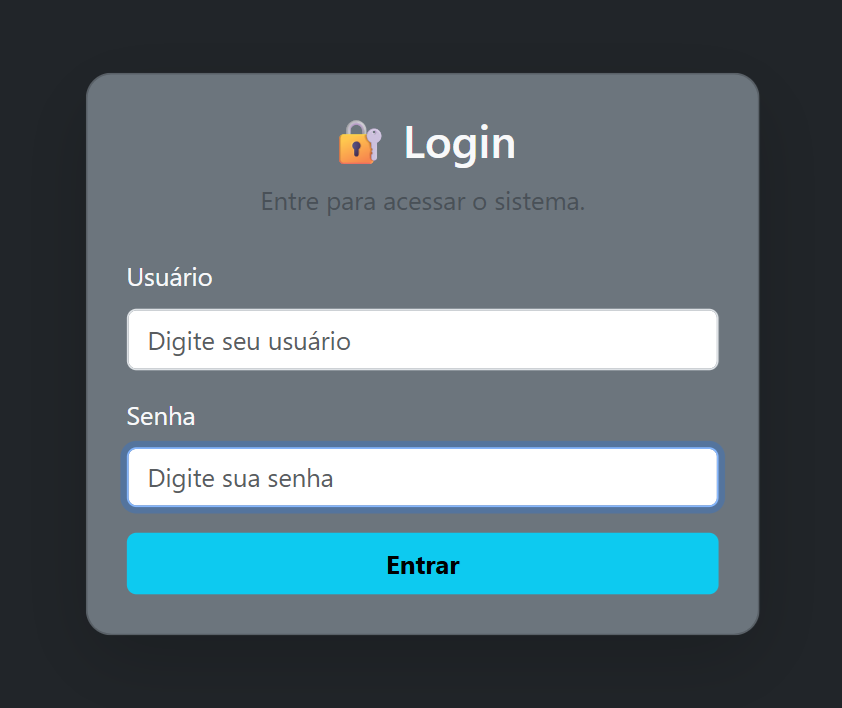
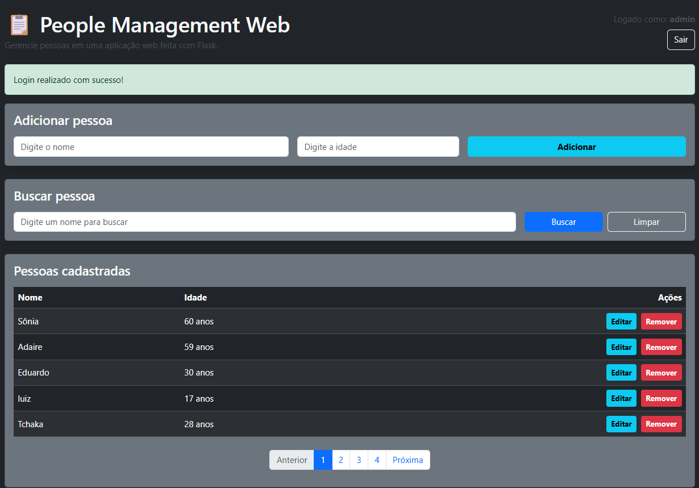
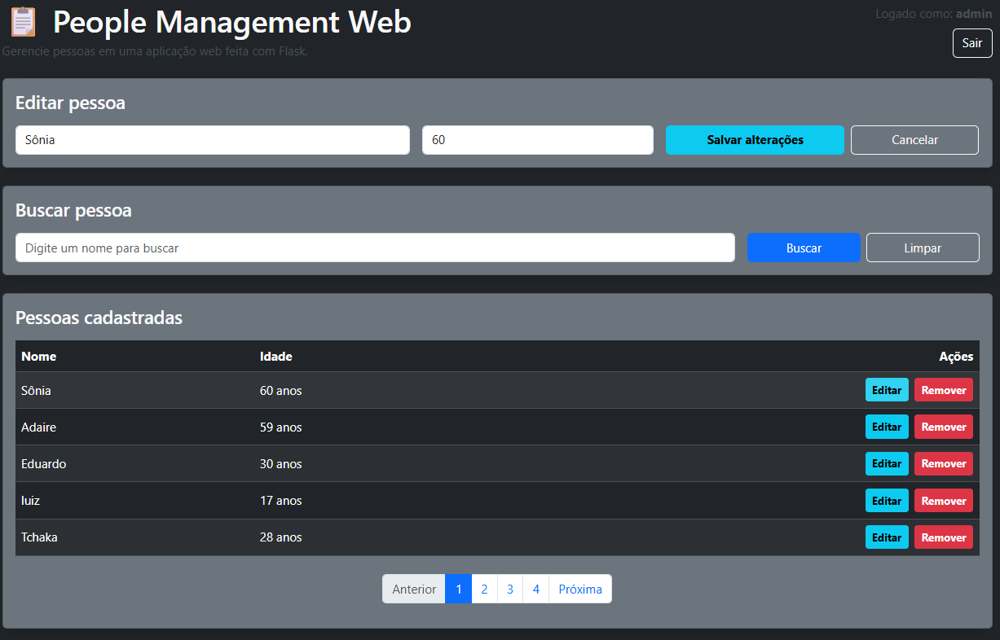

# 📋 People Management Web

Aplicação web desenvolvida com Flask para gerenciamento de pessoas, com autenticação de usuários, CRUD completo, paginação, busca, validações, testes básicos e deploy em produção.

---

## 🚀 Demonstração

Acesse o sistema online:  
👉 https://people-management-web.onrender.com

---

## 🖼️ Screenshots

### Login

### Dashboard

### Edit Person

---

## 🧠 Funcionalidades

- 🔐 Sistema de autenticação de usuários (login/logout)
- 👤 CRUD completo de pessoas
  - Adicionar
  - Editar
  - Remover
- 🔍 Busca por nome
- 📄 Paginação de resultados
- ⚠️ Validação de dados
- 🔒 Senhas armazenadas com hash seguro
- 🧾 Mensagens de feedback para o usuário
- 🖱️ Confirmação antes de remover registros
- ⏳ Botões com estado de carregamento para melhor experiência do usuário
- 🧪 Testes básicos para a camada de serviço
- 🌐 Deploy funcional em produção com Render

---

## 🏗️ Arquitetura do Projeto

O projeto segue uma organização modular inspirada em boas práticas de desenvolvimento:

    app/
    │
    ├── __init__.py        # Criação da aplicação (Application Factory)
    ├── models.py          # Modelos do banco de dados
    ├── routes.py          # Rotas principais do CRUD
    ├── auth.py            # Rotas de autenticação
    ├── services/          # Camada de lógica de negócio
    │   └── pessoa_service.py
    │
    ├── tests/             # Testes básicos da aplicação
    │   └── test_pessoa_service.py
    │
    ├── static/            # Arquivos estáticos (CSS, JS)
    ├── templates/         # Templates HTML (Jinja2)
    │
    assets/
    └── images/            # Screenshots do projeto

    config.py              # Configurações da aplicação
    run.py                 # Inicialização local do servidor
    requirements.txt       # Dependências do projeto
    .gitignore             # Arquivos e pastas ignorados pelo Git

---

## 🧩 Tecnologias Utilizadas

- Python
- Flask
- Flask-Login
- Flask-SQLAlchemy
- Jinja2
- Bootstrap 5
- SQLite
- PostgreSQL
- Gunicorn
- Render
- unittest
- unittest.mock

---

## 🔐 Segurança

- Senhas armazenadas com hash usando `werkzeug.security`
- `SECRET_KEY` configurada por variável de ambiente
- Proteção de rotas com `login_required`
- Gerenciamento seguro de sessão

---

## 🧪 Testes

O projeto possui testes básicos automatizados para a camada de serviço de pessoas, cobrindo:

- criação de pessoa
- atualização de pessoa
- remoção de pessoa

### Rodar os testes

    python -m unittest app.tests.test_pessoa_service

---

## ⚙️ Como Rodar Localmente

### 1. Clone o repositório

    git clone https://github.com/Eduardo-S-Balbino/people-management-web.git
    cd people-management-web

### 2. Crie o ambiente virtual

    python -m venv venv
    venv\Scripts\activate

### 3. Instale as dependências

    pip install -r requirements.txt

### 4. Defina as variáveis de ambiente (opcional)

    set FLASK_ENV=development

### 5. Execute a aplicação

    python run.py

### 6. Acesse no navegador

    http://127.0.0.1:5000

---

## 🔑 Credenciais Padrão

Para facilitar o primeiro acesso, a aplicação pode criar automaticamente um usuário administrador padrão quando o banco ainda não possui esse registro:

    Usuário: admin
    Senha: 1234

---

## 🌐 Deploy

A aplicação está hospedada na Render e passou por ajustes reais de produção durante o processo de deploy.

### Principais pontos do deploy

- configuração do servidor com Gunicorn
- uso do padrão Application Factory com `create_app()`
- ajuste do Start Command na Render para iniciar corretamente a aplicação
- criação automática das tabelas no startup com `db.create_all()`
- criação automática do usuário `admin` quando o banco ainda está vazio
- deploy estabilizado com sucesso após correção de inicialização e banco de dados

### Start Command utilizado na Render

    gunicorn "app:create_app()"

---

## 📈 Evolução do Projeto

Este projeto evoluiu progressivamente com a implementação de melhorias como:

- estrutura inicial com Flask
- sistema de autenticação
- validações completas
- paginação
- refatoração para camada de serviço
- melhorias de UX com feedback visual e loading
- limpeza e organização do repositório com `.gitignore`
- screenshots no README
- testes básicos automatizados
- melhoria visual da interface
- correção de deploy em produção na Render

---

## 👨‍💻 Autor

Desenvolvido por **Eduardo da Silva Balbino**

- GitHub: https://github.com/Eduardo-S-Balbino
- LinkedIn: https://www.linkedin.com/in/eduardo-da-silva-balbino-1611b3401/
- Portfólio: https://portfolio-ekgq.onrender.com/

---

## 📄 Licença

Este projeto foi criado para fins educacionais e de portfólio.